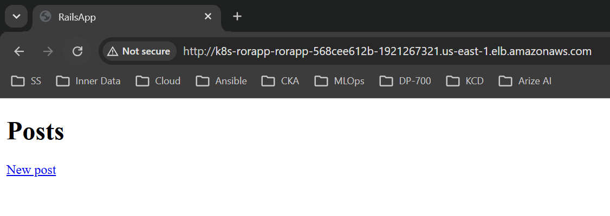
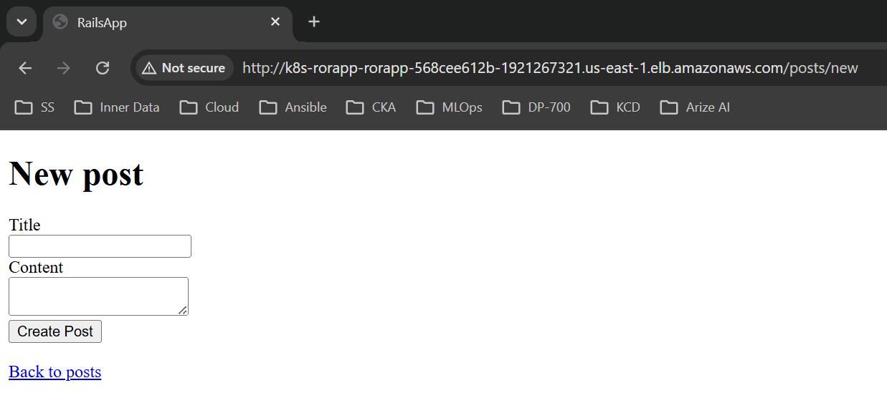
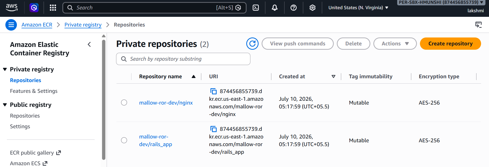
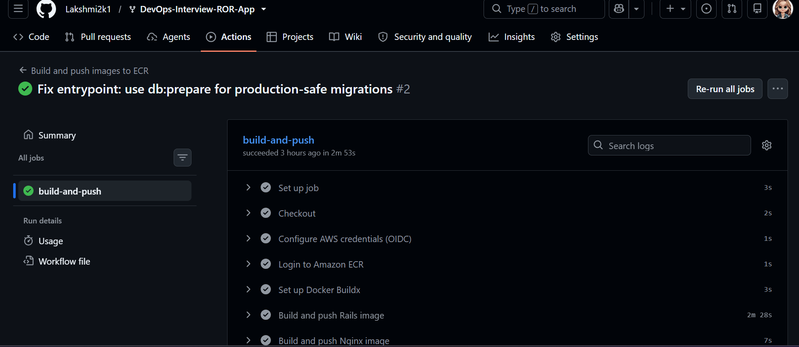
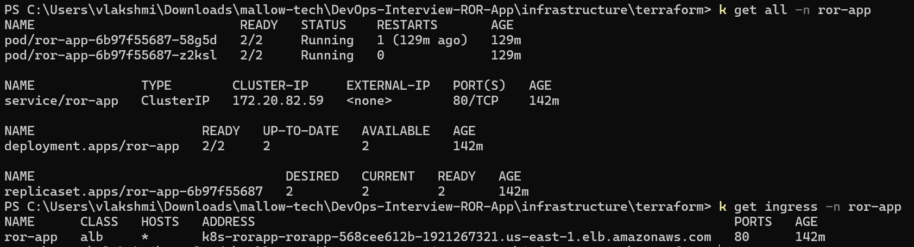
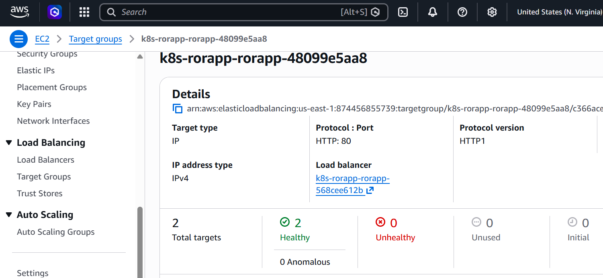
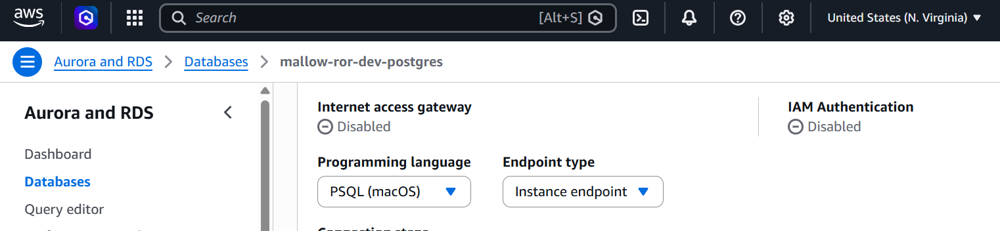
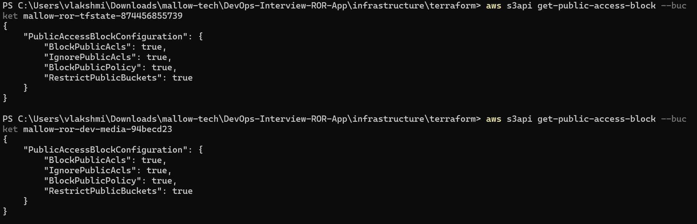

# Infrastructure (IaC) — Ruby on Rails on AWS EKS

This folder provisions a scalable, secure AWS environment for the Dockerized
Ruby on Rails + Nginx application and runs it on Amazon EKS behind an
internet-facing Application Load Balancer.

Responsibilities are split along their natural lifecycles:

- **Terraform** (`terraform/`) — slow-changing AWS infrastructure.
- **Helm chart** (`helm/ror-app/`) — the application (fast-changing).
- **GitHub Actions** (`.github/workflows/`) — builds images and pushes to ECR.

See [architecture.md](architecture.md) for the diagram and design notes.

```
infrastructure/
├── architecture.md          # Architecture diagram + design notes
├── README.md                # This file
├── terraform/               # AWS infrastructure only
│   ├── versions.tf          # Terraform + provider version constraints
│   ├── providers.tf         # AWS + Helm providers
│   ├── variables.tf         # Input variables (with defaults)
│   ├── locals.tf            # Naming + tagging
│   ├── vpc.tf               # VPC, public/private subnets, NAT, S3 endpoint
│   ├── ecr.tf               # ECR repositories (rails_app, nginx)
│   ├── eks.tf               # EKS cluster + managed node group (2 nodes)
│   ├── rds.tf               # RDS PostgreSQL + Secrets Manager
│   ├── s3.tf                # S3 bucket + app IRSA role (IAM-role S3 access)
│   ├── alb-controller.tf    # AWS Load Balancer Controller (Helm) + IRSA
│   ├── github-oidc.tf       # GitHub Actions OIDC role for ECR push
│   ├── outputs.tf           # Useful outputs
│   └── terraform.tfvars.example
└── helm/ror-app/            # Application (Helm chart)
    ├── Chart.yaml
    ├── values.yaml
    ├── values.example.yaml  # Example wiring from terraform outputs
    └── templates/           # SA, ConfigMaps, Secret, Deployment, Service, Ingress
```

## Prerequisites

Install and configure the following:

- [Terraform](https://developer.hashicorp.com/terraform/install) >= 1.5
- [AWS CLI v2](https://docs.aws.amazon.com/cli/latest/userguide/getting-started-install.html), authenticated to an account with admin-level permissions
- [kubectl](https://kubernetes.io/docs/tasks/tools/)
- [Helm](https://helm.sh/docs/intro/install/) >= 3.8
- [Docker](https://docs.docker.com/get-docker/) (only needed for local image builds)

> Terraform's Helm provider (used only to install the AWS Load Balancer
> Controller) authenticates to EKS via `aws eks get-token`, so the AWS CLI must
> be on your `PATH` and authenticated.

## What gets created

| Requirement (PDF / README)                | Implemented by                                              |
| ----------------------------------------- | ----------------------------------------------------------- |
| Build image + push to ECR                 | `.github/workflows/build-and-push.yml` + `github-oidc.tf`   |
| ECR image registry                        | `ecr.tf`                                                    |
| Scalable ECS/**EKS** compute (2 nodes)    | `eks.tf`                                                    |
| ELB to distribute traffic                 | ALB via `alb-controller.tf` + Helm chart `Ingress`          |
| Everything private except the LB          | `vpc.tf` (private subnets) + Ingress `scheme: internet-facing` |
| RDS PostgreSQL                            | `rds.tf`                                                    |
| S3 bucket                                 | `s3.tf`                                                     |
| Private S3 network path                   | S3 Gateway VPC Endpoint in `vpc.tf`                         |
| S3 via **IAM role** (no keys)             | `s3.tf` IRSA role + `config/storage.yml` (no keys)          |
| DB via host/name/user/password            | Helm `Secret`/`ConfigMap` injected as `RDS_*` env vars      |

## Deployment steps

### 0. One-time: create the remote state bucket

Terraform stores its state in S3 (see the `backend "s3"` block in `versions.tf`).
The state bucket must exist **before** `terraform init`, so it is created once,
out-of-band. Requires Terraform >= 1.10 (native S3 state locking, no DynamoDB).

```bash
BUCKET=mallow-ror-tfstate-874456855739   # must match versions.tf; globally unique
REGION=us-east-1

aws s3api create-bucket --bucket "$BUCKET" --region "$REGION"
aws s3api put-bucket-versioning --bucket "$BUCKET" \
  --versioning-configuration Status=Enabled
aws s3api put-bucket-encryption --bucket "$BUCKET" \
  --server-side-encryption-configuration \
  '{"Rules":[{"ApplyServerSideEncryptionByDefault":{"SSEAlgorithm":"AES256"}}]}'
aws s3api put-public-access-block --bucket "$BUCKET" \
  --public-access-block-configuration \
  BlockPublicAcls=true,IgnorePublicAcls=true,BlockPublicPolicy=true,RestrictPublicBuckets=true
```

> If you change the bucket name here, update it in `versions.tf` too.
> `us-east-1` must NOT pass `--create-bucket-configuration`; other regions do,
> e.g. `--create-bucket-configuration LocationConstraint=$REGION`.

### 1. Provision the AWS infrastructure (Terraform)

```bash
cd infrastructure/terraform
cp terraform.tfvars.example terraform.tfvars   # edit if desired (defaults are fine)

terraform init   # connects to the S3 backend created in step 0

# Bring up the cluster first so the Helm provider (ALB controller) can attach
terraform apply -target=module.vpc -target=module.eks

# Then apply the rest (ECR, RDS, S3, IRSA, ALB controller, CI OIDC role)
terraform apply
```

The two-step apply avoids a provider bootstrap race: the Helm provider that
installs the AWS Load Balancer Controller needs the cluster API to exist first.

### 2. Build and push the images to ECR

The workflow `.github/workflows/build-and-push.yml` builds both images and
pushes them to ECR on every push to `main`. Configure the repo once:

```bash
terraform output github_actions_role_arn   # -> set as GitHub secret AWS_ROLE_ARN
```

In the GitHub repo: **Settings → Secrets and variables → Actions**
- Secret `AWS_ROLE_ARN` = the value above
- (optional) Variables `AWS_REGION`, `ECR_RAILS_REPO`, `ECR_NGINX_REPO`

Then push to `main` (or run the workflow manually) to produce images.

### 3. Deploy the application (Helm)

Point kubectl at the cluster, pull the DB password from Secrets Manager, and
install the chart wired to the Terraform outputs:

```powershell
cd infrastructure/terraform
aws eks update-kubeconfig --region $(terraform output -raw region) --name $(terraform output -raw eks_cluster_name)

$DB_PASSWORD = (aws secretsmanager get-secret-value --secret-id $(terraform output -raw rds_secret_arn) --query SecretString --output text | ConvertFrom-Json).password

helm upgrade --install ror-app ../helm/ror-app `
  --namespace "$(terraform output -raw app_namespace)" --create-namespace `
  --set image.rails.repository="$(terraform output -raw ecr_rails_repository_url)" `
  --set image.nginx.repository="$(terraform output -raw ecr_nginx_repository_url)" `
  --set image.pullPolicy=Always `
  --set serviceAccount.roleArn="$(terraform output -raw app_irsa_role_arn)" `
  --set env.RDS_HOSTNAME="$(terraform output -raw rds_endpoint)" `
  --set env.RDS_DB_NAME="$(terraform output -raw db_name)" `
  --set env.RDS_USERNAME="$(terraform output -raw db_username)" `
  --set env.S3_BUCKET_NAME="$(terraform output -raw s3_bucket_name)" `
  --set env.S3_REGION_NAME="$(terraform output -raw region)" `
  --set env.LB_ENDPOINT="$(kubectl get ingress -n ror-app -o jsonpath='{.items[0].status.loadBalancer.ingress[0].hostname}')" `
  --set secret.RDS_PASSWORD="$DB_PASSWORD" `
  --wait --timeout 10m
```

> On the very first install the Ingress/ALB doesn't exist yet, so
> `env.LB_ENDPOINT` resolves empty — that's expected. Run `helm upgrade`
> again once the ALB hostname is available (see step 4) to set it.
>
> `terraform output helm_install_hint` prints a ready-made version of this
> command. To bump images later: `helm upgrade ...` again, or
> `kubectl -n ror-app rollout restart deployment/ror-app`.

### 4. Get the application URL

```bash
kubectl get ingress -n ror-app \
  -o jsonpath='{.items[0].status.loadBalancer.ingress[0].hostname}'
```

Open `http://<that-hostname>/` in a browser (the ALB takes 1-3 minutes to come up).

## Screenshots

Evidence that the deployment works end-to-end lives in
[`screenshots/`](screenshots/) and is embedded here:

**Application**

| Posts list (`/`) | Creating a post |
| ----------------- | ---------------- |
|  |  |

**AWS**

| ECR images | GitHub Actions build | EKS pods / ingress |
| ---------- | --------------------- | -------------------- |
|  |  |  |

| Load balancer | RDS (private) | S3 (blocked public access) |
| -------------- | -------------- | ---------------------------- |
|  |  |  |

## Environment variables

Rendered by the Helm chart into a `ConfigMap` (non-secret) and a `Secret`
(secret), then injected via `envFrom`:

| Variable          | Source                                    |
| ----------------- | ----------------------------------------- |
| `RDS_DB_NAME`     | Helm `env.RDS_DB_NAME`                     |
| `RDS_USERNAME`    | Helm `env.RDS_USERNAME`                    |
| `RDS_PASSWORD`    | Helm `secret.RDS_PASSWORD` (Secrets Manager) |
| `RDS_HOSTNAME`    | Helm `env.RDS_HOSTNAME` (RDS endpoint)    |
| `RDS_PORT`        | Helm `env.RDS_PORT` (5432)                |
| `S3_BUCKET_NAME`  | Helm `env.S3_BUCKET_NAME`                 |
| `S3_REGION_NAME`  | Helm `env.S3_REGION_NAME`                 |
| `LB_ENDPOINT`     | Full ALB hostname (step 4), added to Rails' `config.hosts` allow-list |

S3 uses IRSA, so no `ACCESS_KEY_ID` / `SECRET_ACCESS_KEY` are ever set.

## Cleanup

```bash
# Remove the app first so the ALB controller deletes the ALB
helm uninstall ror-app -n ror-app

cd infrastructure/terraform
terraform destroy
```

## Notes

- **PostgreSQL version**: the README asks for `13.3`, but AWS has since
  retired that minor version (`aws rds describe-db-engine-versions --engine
  postgres --engine-version 13.3` returns empty). `db_engine_version` is
  pinned to `13.23`, the latest available `13.x` minor version in
  `us-east-1` at the time of writing.
- **Node size**: `t3.small` × 2 is sufficient for this demo. Increase
  `node_instance_types` / `node_desired_size` for more headroom.
- **Remote state**: for team use, enable the S3 backend block in `versions.tf`.
