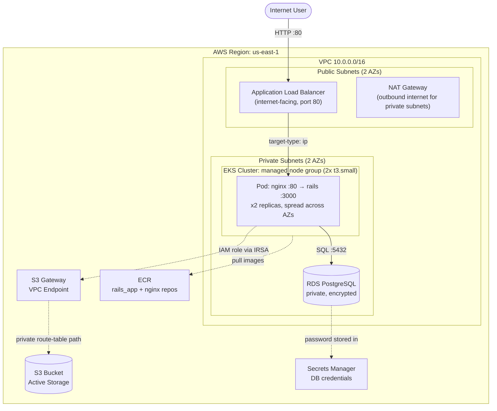

# Architecture

## Overview

The Ruby on Rails application is packaged as two containers (Rails + Nginx) and
deployed to **Amazon EKS**. An internet-facing **Application Load Balancer**
(the only public component) distributes traffic to the pods. **RDS PostgreSQL**
and the **EKS worker nodes** live entirely in **private subnets**. The app
reaches **S3** through an **IAM role (IRSA)** — no static access keys anywhere.
Private-subnet S3 traffic is routed through an **S3 Gateway VPC Endpoint** so
it stays on the AWS backbone and does not traverse the NAT gateway.

## Diagram

## Traffic flow

1. A user hits the **ALB** DNS name on port 80.
2. The ALB forwards the request directly to the **Nginx** container of a healthy
   pod (`target-type: ip`, so pod IPs are registered as targets).
3. **Nginx** proxies the request to the **Rails** (Puma) container on
   `127.0.0.1:3000` within the same pod.
4. Rails talks to **RDS PostgreSQL** over the private network on port 5432.
5. Rails reads/writes objects in **S3** using credentials obtained through
    **IRSA** (the pod's service account is annotated with an IAM role ARN), and
    the traffic uses the **S3 Gateway VPC Endpoint** path from private subnets.

## Security highlights

| Concern            | Approach                                                                 |
| ------------------ | ------------------------------------------------------------------------ |
| Network exposure   | Only the ALB is public; nodes and RDS are in private subnets.            |
| S3 access          | IAM role via IRSA — no access keys or secrets in the app.                |
| S3 network path    | Gateway VPC Endpoint from private subnets (no NAT for S3 traffic).        |
| DB credentials     | Auto-generated, stored in AWS Secrets Manager, injected as a K8s Secret. |
| RDS reachability   | Security group only allows 5432 from the EKS node security group.        |
| Data at rest       | RDS storage encrypted; S3 bucket SSE + public access blocked.            |
| Image provenance   | Images stored in private ECR, scanned on push.                          |

## Components

**Provisioned by Terraform (`infrastructure/terraform/`):**

- **VPC** with public + private subnets across 2 AZs, IGW, NAT gateway.
- **ECR** repositories: `mallow-ror-dev/rails_app`, `mallow-ror-dev/nginx`.
- **EKS** cluster (v1.30) + managed node group (2 × t3.small) in private subnets.
- **RDS** PostgreSQL 13.x (private, encrypted) + Secrets Manager secret.
- **S3** bucket (private, versioned, encrypted) + IAM policy/role (IRSA).
- **AWS Load Balancer Controller** (Helm) + its IRSA role.
- **GitHub Actions OIDC** provider + IAM role scoped to ECR push.

**Deployed by the Helm chart (`infrastructure/helm/ror-app/`):**

- ServiceAccount (IRSA-annotated), ConfigMap (env), Secret (DB password +
  secret_key_base), Nginx ConfigMap, Deployment (2 replicas), Service, and the
  Ingress that makes the controller create the ALB.

**Built by CI (`.github/workflows/build-and-push.yml`):**

- Rails and Nginx Docker images, pushed to ECR on every push to `main`.
